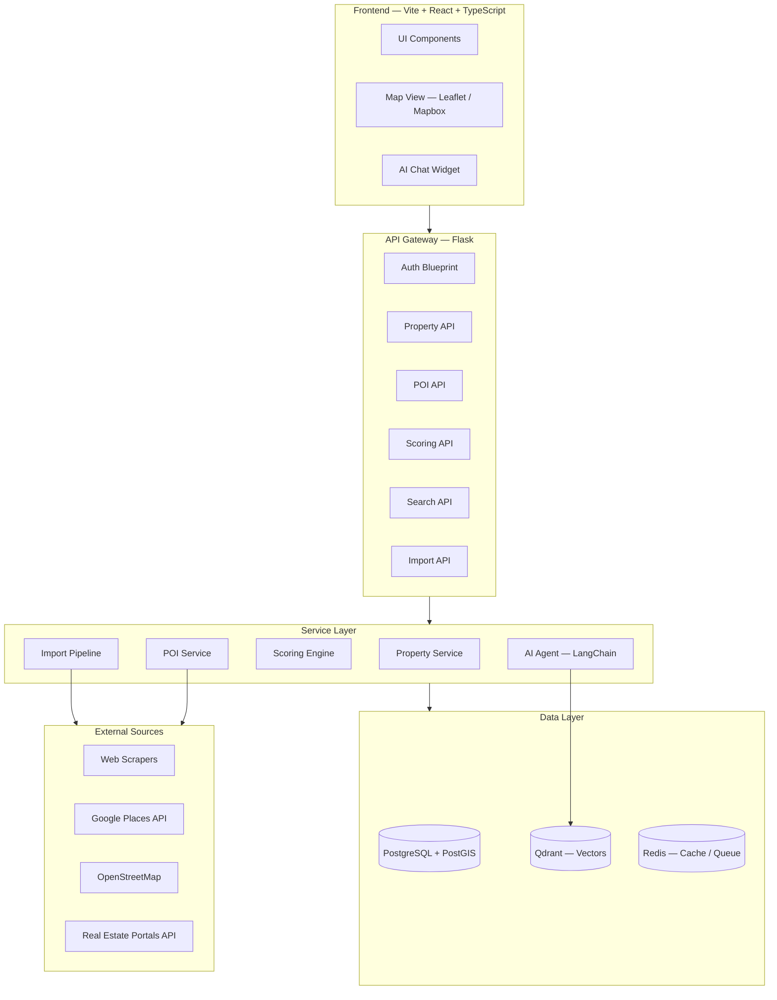
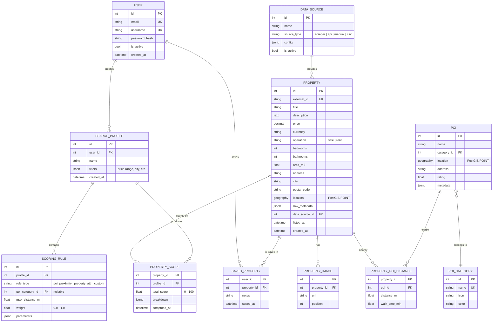
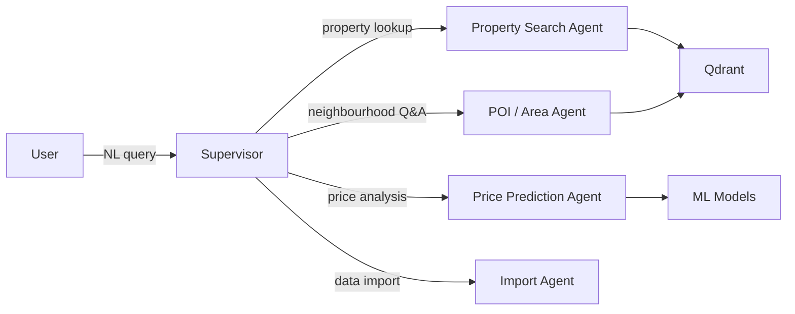
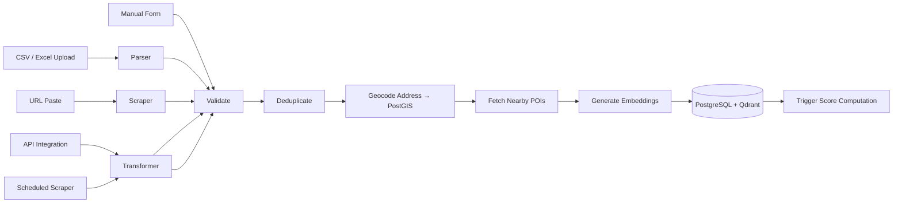

# NestScout — Real Estate Intelligence Platform

## Design Document v1.0

---

## 1. Vision & Problem Statement

Buying, renting, or investing in real estate is one of the highest-stakes decisions a person makes — yet the tools available treat every user the same. Generic portals show properties sorted by price or date, ignoring that **what makes a location perfect is deeply personal**: one person needs a quiet street near a nursery school, another wants walkable nightlife and a gym within 500 m.

**NestScout** is an AI-powered real estate intelligence platform that:

1. **Aggregates properties** from multiple sources (scrapers, APIs, manual entry, bulk CSV/Excel import).
2. **Enriches every listing** with surrounding **Points of Interest (POIs)** — cafés, schools, supermarkets, malls, clinics, public transport, parks, etc.
3. **Lets each user define weighted scoring rules** to produce a **100 % personalised ranking** of every property.
4. **Uses AI/ML** to recommend properties, predict price trends, auto-classify listings, and power a natural-language search assistant.

> **In short:** _"Show me apartments under €250 k within 10 min walk of a metro station, near good schools, with a café culture score above 80 — ranked by MY priorities."_

---

## 2. Core Concepts

| Concept | Description |
|---|---|
| **Property** | A real estate listing (sale/rent) with location, price, features, images, and source metadata. |
| **POI (Point of Interest)** | A business or service near a property — cafés, shops, schools, hospitals, etc. Sourced from Google Places, OpenStreetMap, or user submissions. |
| **Search Profile** | A saved set of user-defined rules & weights that produce a personal score for every property. A user can have many profiles (e.g. "Family Home", "Investment Flat"). |
| **Scoring Rule** | A single criterion inside a profile: _"School within 1 km → weight 30 %"_, _"Metro < 500 m → weight 25 %"_, _"Supermarket < 300m → weight 10%"_. |
| **Personal Score** | A 0–100 composite value computed per property per profile, so two users see entirely different rankings for the same dataset. |

---

## 3. User Stories

### 3.1 Property Seekers (Buyers / Renters)

- As a user, I can **import properties** from a URL, CSV file, or by pasting raw text so that I track listings from any source.
- As a user, I can **create search profiles** with custom rules and weights so that properties are ranked by what matters to me.
- As a user, I can **see a live map** with properties colour-coded by my personal score.
- As a user, I can **ask the AI assistant** natural-language questions: _"Which of my saved properties has the best school access?"_

### 3.2 Data Contributors

- As a contributor, I can **add or correct POIs** (e.g. a new café that opened) so the neighborhood data stays fresh.
- As a contributor, I can **submit property listings** manually with photos and details.

### 3.3 Administrators

- As an admin, I can **manage data sources** (enable/disable scrapers, set import schedules).
- As an admin, I can **view analytics** on user engagement, data quality, and platform health.

---

## 4. High-Level Architecture



---

## 5. Technical Stack

| Layer | Technology | Rationale |
|---|---|---|
| **Frontend** | Vite + React + TypeScript | Fast dev server, strict typing, feature-based structure (per project rules). |
| **Backend API** | Flask (Application Factory) | Project standard. Blueprints for modular routing, service layer for logic separation. |
| **ORM / DB** | SQLAlchemy 2.0 + Alembic | `Mapped[]` / `mapped_column()` style. Migrations via `flask db migrate`. |
| **Database** | PostgreSQL 16 + PostGIS | Spatial queries for proximity (ST_DWithin, ST_Distance), JSONB for flexible metadata. |
| **Vector Store** | Qdrant | Semantic search on property descriptions, AI agent RAG context. |
| **Cache / Queue** | Redis | Caching scores, rate-limiting, Celery task broker for async imports. |
| **Task Queue** | Celery | Background jobs: scraping, bulk import, score recalculation, POI enrichment. |
| **AI / ML** | LangChain + Local LLM (LM Studio / Ollama) | Agentic workflows: NL search, auto-classification, price prediction. |
| **ML Models** | Scikit-learn / XGBoost | Price prediction, anomaly detection, neighbourhood clustering. |
| **Maps** | Leaflet.js + Mapbox tiles | Interactive property map with score heat-map overlay. |
| **Containerisation** | Docker (multi-stage, non-root) | Per project Docker rules. |

---

## 6. Data Model

### 6.1 Entity Relationship Diagram



### 6.2 Key Design Decisions

| Decision | Rationale |
|---|---|
| **PostGIS `geography` column** | Enables fast spatial queries (`ST_DWithin`) for "find POIs within X meters" without manual haversine math. |
| **`PROPERTY_POI_DISTANCE` join table** | Pre-computed distances avoid expensive real-time geo queries. Refreshed async by Celery when new POIs/properties appear. |
| **`PROPERTY_SCORE` materialised** | Scores are cached per profile×property pair. Recomputed on rule change or new data. Avoids re-running scoring on every page load. |
| **`raw_metadata` JSONB** | Different sources provide wildly different fields. JSONB captures everything without rigid schema. |
| **`scoring_rule.parameters` JSONB** | Allows rule types we haven't invented yet (e.g. "noise level < X dB") without schema migrations. |

---

## 7. Scoring Engine — Deep Dive

The scoring engine is the **differentiating feature**. Every property gets a personal score per search profile.

### 7.1 Algorithm

```
For each Property P and Profile R:
    total = 0
    weight_sum = 0

    For each ScoringRule S in R:
        raw_value = evaluate(S, P)           # 0.0 – 1.0
        total += raw_value × S.weight
        weight_sum += S.weight

    P.score = (total / weight_sum) × 100     # Normalised to 0–100
```

### 7.2 Rule Types

| Rule Type | Evaluation Logic |
|---|---|
| **`poi_proximity`** | Find nearest POI of category C within `max_distance_m`. Score = `1 - (distance / max_distance)`. If none found → 0. |
| **`poi_density`** | Count POIs of category C within radius R. Score = `min(count / target_count, 1.0)`. |
| **`property_attr`** | Compare property attribute (price, area, bedrooms) against user's ideal range. Score = how close to ideal. |
| **`walkability`** | Composite of walk-time to nearest POIs across multiple categories. |
| **`ai_sentiment`** | ML model scores the listing description for quality signals (e.g. "recently renovated", "sunny", "quiet street"). |
| **`price_value`** | ML-predicted fair price vs listed price. Score = how much below predicted → good deal. |

### 7.3 Recalculation Strategy

- **On rule change** → Recompute scores for that profile only (Celery task).
- **On new property** → Compute scores for all active profiles (async batch).
- **On new POI** → Recompute distances for nearby properties, then update affected scores.
- **Nightly** → Full recomputation sweep for data freshness.

---

## 8. AI & ML Components

### 8.1 AI Agent (LangChain Supervisor)

Following the project's LangChain rules, the AI layer uses a **supervisor agent** that delegates to specialised sub-agents:



| Sub-Agent | Purpose | Tools |
|---|---|---|
| **Property Search** | Converts NL queries to structured filters + vector search. | `search_properties`, `get_property_details` |
| **POI / Area Agent** | Answers questions about neighbourhoods, nearby services. | `search_pois`, `get_area_stats` |
| **Price Prediction** | Estimates fair market value, flags deals. | `predict_price`, `get_comparables` |
| **Import Agent** | Helps users import from URLs or pasted text by extracting structured data. | `parse_listing_url`, `create_property` |

### 8.2 ML Models

| Model | Algorithm | Training Data | Purpose |
|---|---|---|---|
| **Price Predictor** | XGBoost regression | Historical listings (price, area, bedrooms, location, POI density) | Estimate fair value, flag under/over-priced. |
| **Listing Classifier** | Text classification (fine-tuned embeddings) | Labelled descriptions | Auto-tag: "renovated", "garden", "parking", "furnished". |
| **Neighbourhood Clustering** | K-Means on POI density vectors | POI data per grid cell | Group areas by character: "family-friendly", "nightlife hub", "commercial". |
| **Anomaly Detector** | Isolation Forest | Price per m² distribution per area | Flag suspicious listings (scams, data errors). |

### 8.3 Embeddings & RAG

- Property descriptions → embedded via local model → stored in **Qdrant**.
- User queries → embedded → semantic similarity search against properties.
- Results fed as context to the LangChain agent for grounded answers.

---

## 9. Import Pipeline

The platform supports multiple ingestion methods to maximise property coverage:



| Method | Details |
|---|---|
| **Manual Form** | Standard form with address autocomplete (Google/Mapbox). |
| **CSV / Excel** | Column mapping UI. Supports batch import of hundreds of listings. |
| **URL Paste** | AI-powered extraction: paste a listing URL → agent scrapes & structures the data. |
| **API Integration** | Connectors for major portals (Idealista, Fotocasa, Immobilienscout24, etc.). |
| **Scheduled Scrapers** | Celery Beat tasks that periodically pull new listings from configured sources. |

All methods converge at a **validation → deduplication → geocoding → POI enrichment → embedding → scoring** pipeline.

---

## 10. API Design

### 10.1 Blueprint Structure

Following the Flask Application Factory pattern:

| Blueprint | Prefix | Responsibility |
|---|---|---|
| `auth_bp` | `/api/auth` | Register, login, token refresh. |
| `properties_bp` | `/api/properties` | CRUD, search, filters, map-view endpoints. |
| `pois_bp` | `/api/pois` | POI CRUD, category management. |
| `profiles_bp` | `/api/profiles` | Search profile & scoring rule management. |
| `scores_bp` | `/api/scores` | Retrieve personal scores, trigger recalculation. |
| `import_bp` | `/api/import` | CSV upload, URL import, source management. |
| `ai_bp` | `/api/ai` | Chat endpoint (streaming), suggestions. |
| `admin_bp` | `/api/admin` | Data source config, analytics, user management. |

### 10.2 Key Endpoints

```text
POST   /api/auth/register
POST   /api/auth/login
POST   /api/auth/refresh

GET    /api/properties                     # Filtered list + personal scores
GET    /api/properties/:id                 # Detail + POI distances + score breakdown
GET    /api/properties/map                 # GeoJSON for map rendering
POST   /api/properties                     # Manual add

POST   /api/import/csv                     # Upload CSV/Excel
POST   /api/import/url                     # AI-powered URL extraction
GET    /api/import/sources                 # List data sources

GET    /api/pois?lat=...&lng=...&radius=.. # Nearby POIs
GET    /api/pois/categories                # All categories

POST   /api/profiles                       # Create search profile
PUT    /api/profiles/:id/rules             # Update scoring rules
GET    /api/scores/:profileId              # Ranked property list

POST   /api/ai/chat                        # Streaming AI response
```

---

## 11. Frontend Architecture

### 11.1 Feature Structure

```text
src/
├── features/
│   ├── auth/              # Login, Register, AuthGuard
│   ├── properties/        # PropertyList, PropertyDetail, PropertyCard
│   ├── map/               # MapView, ScoreHeatmap, POIMarkers
│   ├── profiles/          # ProfileEditor, RuleBuilder, WeightSliders
│   ├── import/            # CSVUploader, URLImporter, ColumnMapper
│   ├── ai-chat/           # ChatWidget, MessageBubble, StreamingText
│   └── dashboard/         # Stats, Charts, RecentActivity
├── ui/                    # Button, Input, Modal, Slider, Badge
├── lib/                   # apiClient, queryClient, config
└── styles/                # variables.css, reset.css, animations.css
```

### 11.2 Key Views

| View | Description |
|---|---|
| **Explorer** | Split-panel: interactive map (left) + ranked property cards (right). Colour-coded pins by personal score (red → yellow → green). |
| **Property Detail** | Full listing with image gallery, score breakdown radar chart, nearby POIs map, price prediction comparison. |
| **Profile Builder** | Drag-and-drop rule builder with weight sliders (sum must = 100 %). Live preview of top-5 properties as rules change. |
| **Import Hub** | Tabbed interface: CSV upload, URL paste, API source management. Progress tracking for bulk imports. |
| **AI Chat** | Floating widget with streaming responses. Context-aware: references currently viewed property or search results. |

---

## 12. Infrastructure & Deployment

### 12.1 Docker Compose (Development)

```text
services:
  api           → Flask app (hot-reload)
  worker        → Celery worker
  beat          → Celery Beat scheduler
  frontend      → Vite dev server
  postgres      → PostgreSQL 16 + PostGIS
  redis         → Redis 7
  qdrant        → Qdrant vector DB
  lm-studio     → Local LLM inference (optional, can be external)
```

### 12.2 Production Considerations

- **Container orchestration**: Docker Swarm or Kubernetes.
- **Database**: Managed PostgreSQL (AWS RDS / GCP Cloud SQL) with PostGIS extension.
- **CDN**: Frontend served via Cloudflare / Vercel.
- **CI/CD**: GitHub Actions → build → test → push image → deploy.
- **Monitoring**: Prometheus + Grafana for API metrics, Sentry for error tracking.

---

## 13. Security

| Concern | Approach |
|---|---|
| **Authentication** | JWT (access + refresh tokens), bcrypt password hashing. |
| **Authorisation** | Role-based (user, contributor, admin). Decorator-based route protection. |
| **API Rate Limiting** | Redis-backed rate limiter per user/IP. |
| **Input Validation** | Pydantic / Marshmallow schemas on all endpoints. |
| **Secrets** | `.env` files (dev), Kubernetes Secrets / AWS Secrets Manager (prod). Never in Docker `ENV`. |
| **CORS** | Strict origin whitelist. |
| **SQL Injection** | SQLAlchemy parameterised queries only. No raw SQL. |

---

## 14. Development Phases

### Phase 1 — Foundation (Weeks 1–3)

- [ ] Project scaffolding (Flask factory, extensions, config)
- [ ] User auth (register, login, JWT)
- [ ] Property model + CRUD API
- [ ] POI model + category management
- [ ] PostgreSQL + PostGIS setup
- [ ] Basic frontend: property list + detail views

### Phase 2 — Core Intelligence (Weeks 4–6)

- [ ] Search profiles & scoring rules API
- [ ] Scoring engine implementation
- [ ] POI proximity computation (spatial queries)
- [ ] Property import: manual form + CSV upload
- [ ] Interactive map with score-coloured pins
- [ ] Profile builder UI with weight sliders

### Phase 3 — AI & Import (Weeks 7–9)

- [ ] Qdrant integration + property embeddings
- [ ] LangChain agent setup (supervisor + sub-agents)
- [ ] AI chat widget (streaming)
- [ ] URL-based property import (AI extraction)
- [ ] Scheduled scrapers (Celery Beat)
- [ ] Deduplication pipeline

### Phase 4 — ML & Polish (Weeks 10–12)

- [ ] Price prediction model (XGBoost)
- [ ] Listing auto-classification
- [ ] Neighbourhood clustering
- [ ] Anomaly detection (scam flagging)
- [ ] Dashboard with analytics
- [ ] Performance optimisation & caching
- [ ] Docker production config
- [ ] Documentation & API docs (Swagger / OpenAPI)

---

## 15. Success Metrics

| Metric | Target |
|---|---|
| **Score computation latency** | < 200 ms for a profile with 10 rules over 1 000 properties. |
| **Import throughput** | Process 500 CSV rows in < 30 s, including geocoding & POI enrichment. |
| **AI response time** | First token streamed < 2 s (local LLM). |
| **Map rendering** | Smooth pan/zoom with 5 000+ markers (clustered). |
| **Search relevance** | User satisfaction > 80 % on personal score accuracy (survey). |

---

> **Next step:** Approve this design, then we scaffold Phase 1.
